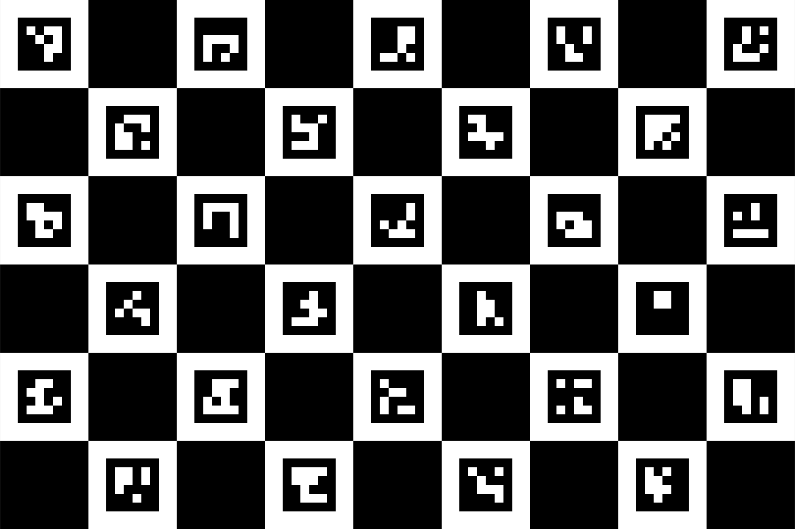
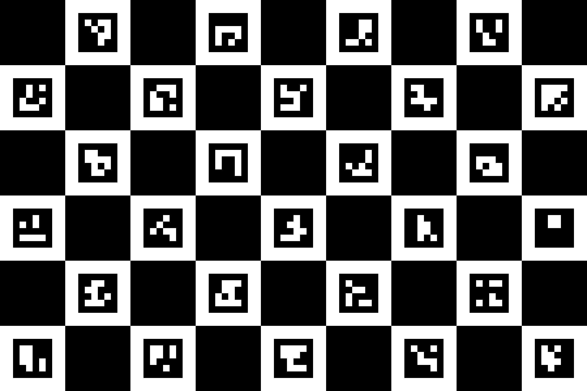
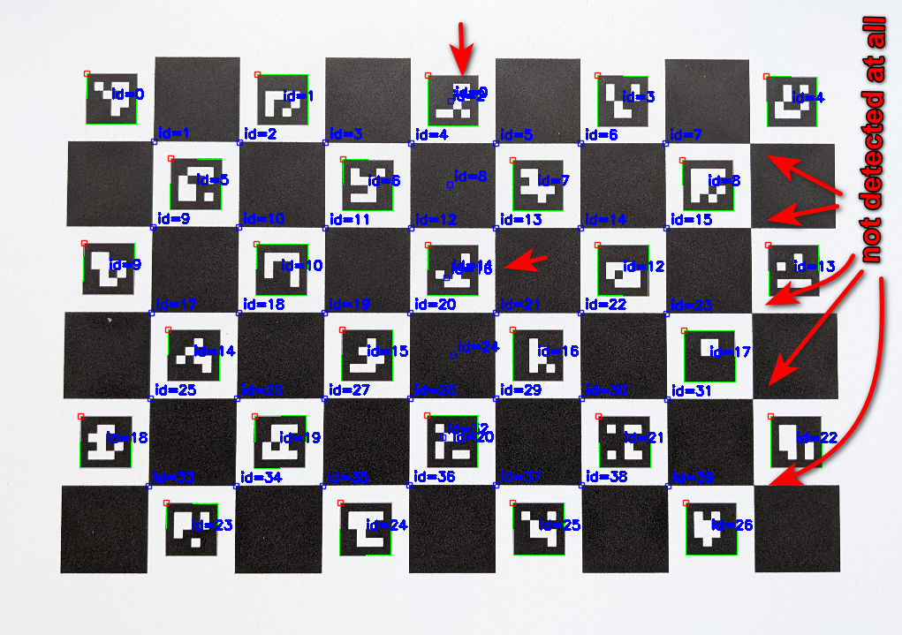
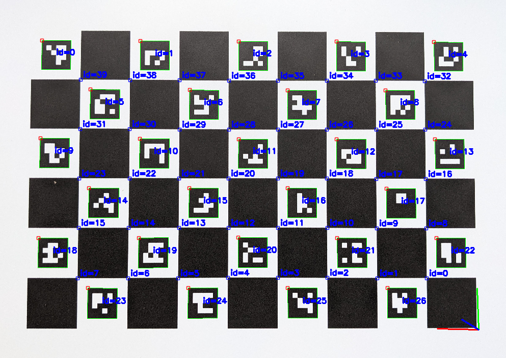

# Reproduction of bug in OpenCV's MarkerPrinter tool

This repository demonstrates/reproduces a bug that leads to faulty Charuco boards
generated by OpenCV's MarkerPrinter tool.

The MarkerPrinter tool can be found here:
https://github.com/opencv/opencv_contrib/tree/4.x/modules/aruco/misc/pattern_generator

## Example: Board generated by MarkerPrinter

Consider the following command:

    python MarkerPrinter.py --charuco --file "./charuco.svg" --dictionary DICT_4X4_1000 --size_x 9 --size_y 6 --square_length 0.25 --marker_length 0.15 --border_bits 1

Look at the result. Note that the top-left square is a **white** square:

## Example: Board generated by OpenCV

Compare this with the board generated/expected by OpenCV *when using the same parameters* (same dictionary, same board size etc):

    python generate_board_with_opencv.py --pattern-size 9 6

Now the top-left square is a **black** square:

## Consequence

As a consequence, OpenCV will be unable to properly detect the Charuco board that was generated by the MarkerPrinter tool. OpenCV expects the top-left
square to be **black**. Therefore many corners will not be detected at all and there will be all kinds of misdetections (mislabelled corners/markers etc).

Example of such a broken detection:

## Workaround

If you, like me, don't want to print another Charuco board and repeat the image capturing, you might be interested in the workaround
I used. In your code that uses OpenCV to detect the Charuco board, you can manually specify another Charuco marker order.

    number_of_markers = 27
    ids = np.array(range(number_of_markers)[::-1])  # reverse order
    logger.info("Charuco marker IDs: %s", ids)
    board = cv.aruco.CharucoBoard((PW, PH), square_length, marker_length, dictionary, ids)

By reversing the order of the IDs you're basically rotating the board by 180°. Then, the new top-left square will be a **black square**
(like expected by OpenCV) and OpenCV will properly detect the charuco board and all its corners/markers.

If you apply this workaround to the example board from above, the result will then look like this:

Note that the frameAxes are drawn in the bottom-right corner. Also note how the corner IDs are starting at 0 in the bottom-right
corner. This is because, from OpenCV's perspective, the bottom-right corner now is actually the top-left corner (because the Charuco
marker IDs have been specified in reverse order).
